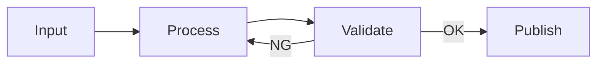

# Blueprint

## 1. Problem Statement

- 誰の何の課題を、なぜ今解くか

## 2. Scope

- In:
- Out:

## 3. Constraints / Assumptions

- 時間/コスト/依存/互換性の前提

## 4. I/O Contract

- Input: 形式・例
- Output: 形式・例

## 5. Minimal Flow

## 6. Interfaces

- CLI/API/Files（エンドポイント/パス命名）
